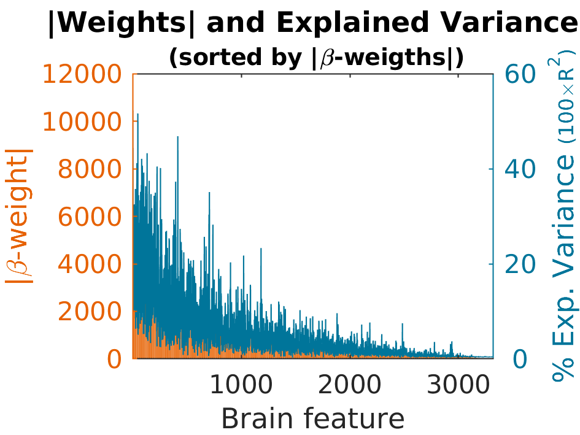
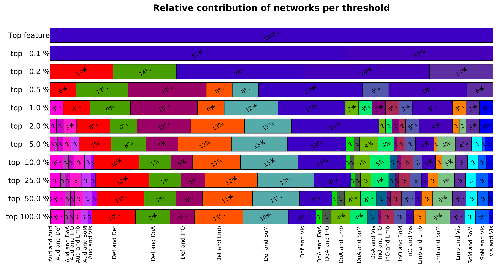
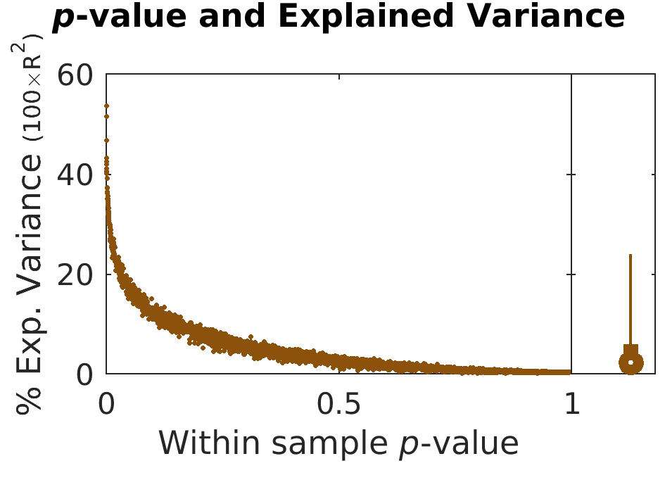
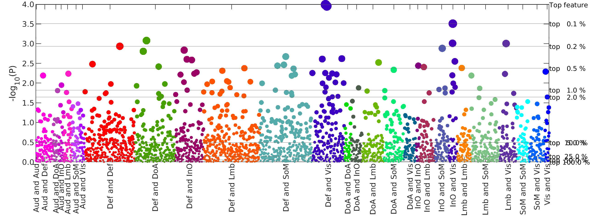

# Exploring outputs

This section explores the various outputs of the code. Of note, there are slight differences in the outputs based on your choice of input (functional connectivity or cortical thickness).

- The beta-weights for functional connectivity data are a summation of the absolute values. For cortical thickness, the beta-weights are not summed.
- Given that cortical thickness data does not entail network-network interactions, all of the network figures (and related subfolders) discussed below do not apply.

```markdown
├── /home/example1  
    ├── BWAS
        └── tables
        ├── figures
            └── weights_explainedvariance
            ├── scatter_plots
               └── by_networks
            └── relativecontributions_plots
            └── pvalues_explainedvariance
            └── manhattan_plots
        └── ciftis
    ├── PNRS
        └── tables
            └── weights_explainedvariance
        └── figures
            └── weights_explainedvariance
            └── scores
            └── scatter_plots
                └── by_top_connection
                └── by_networks
            └── pvalues_explainedvariance_2_samples
            └── pvalues_explainedvariance
            └── explainedvariance_and_null
```

## BWAS

### Tables

- Rsquared.csv
- brain_feature.csv
- correlations_by_networks.csv
- mapping_brain_feature_index_2_ROIs.csv
- scores_by_networks.csv

### Figures

#### Weights by Explained Variance

- AbsWeights_explainedVariance_by_Weight.png



- AbsWeights_explainedVariance_by_brainFeature.png
- AbsWeights_explainedVariance_by_explainedvariance.png
- Weights_explainedVariance_by_Weight.png
- Weights_explainedVariance_by_brainFeature.png
- Weights_explainedVariance_by_explainedvariance.png


#### Scatter Plots

#### Relative Contribution Plots

- Relative_networks_contribution.png



- Relative_networks_contribution_truncated.png

#### P-values by Explained Variance

- pValue_Variance_by_brainFeature.png



- logpValue_Variance_by_brainFeature.png

#### Manhattan Plots

- BWAS_manhattan_plot_like.png



- BWAS_manhattan_plot_covering_less_than_1_percent.png
- BWAS_manhattan_plot_covering_more_than_1_percent.png
- BWAS_manhattan_plot_truncated.png


### Ciftis